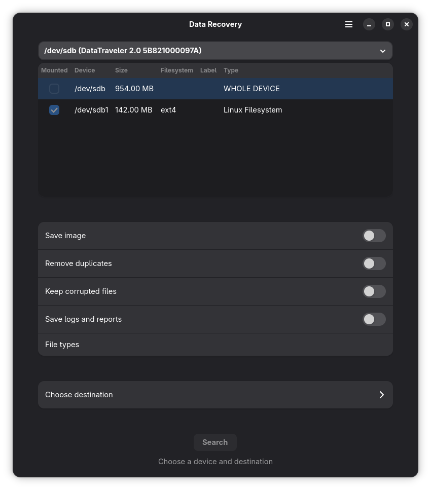

# DataRecovery

<p align="center">
  
</p>

A GTK4/Libadwaita application for data recovery using ddrescue and PhotoRec. Recovers all files (not just deleted ones) from storage devices or disk images, organises them by file type, and optionally removes duplicates using rdfind.

**Important**: Requires significant disk space as images are created first, then files recovered from those images.

---

## 🔄 Process

1. **Source Selection**: Choose a storage device or existing disk image file
2. **Destination Selection**: Choose where recovered files will be saved
3. **Mount Safety**: Automatically detects and handles mounted partitions to prevent corruption
4. **Imaging** (devices only): Creates disk images using 4 passes of ddrescue (details below)
5. **File Recovery**: PhotoRec recovers files from the disk images
6. **File Organization**: Recovered files sorted by extension into organized folders

### User Options

- **Save Images**
- **Remove Duplicates**
- **Keep Corrupted Files**
- **Selective File Type Recovery**
- **Custom Signature Support**
- **SMART Data Monitoring**

### ddrescue 4-Pass Details

1. **Pass 1 - Fast Copy**: Quick sequential read without retries to capture easily readable data
2. **Pass 2 - Direct Access Retry**: Up to 3 retry attempts using direct I/O to bypass system caching
3. **Pass 3 - Reverse Retry**: Read failed sectors in reverse order to minimise mechanical stress
4. **Pass 4 - Final Scraping**: Final attempt with scraping mode for stubborn sectors

---

## 📦 Installation

### Packages

<details>
<summary><b>openSUSE</b></summary>

- Tumbleweed  
  ```bash
  sudo zypper addrepo https://download.opensuse.org/repositories/security:forensics/openSUSE_Tumbleweed/security:forensics.repo
  sudo zypper refresh
  sudo zypper install datarecovery
  ```
- Leap 16
  ```bash
  sudo zypper addrepo https://download.opensuse.org/repositories/security:forensics/16.0/security:forensics.repo
  sudo zypper refresh
  sudo zypper install datarecovery
  ```
- Leap 15.6
  ```bash
  sudo zypper addrepo https://download.opensuse.org/repositories/security:forensics/15.6/security:forensics.repo
  sudo zypper refresh
  sudo zypper install datarecovery
  ```
  [View on OBS](https://build.opensuse.org/package/show/security:forensics/datarecovery)
</details>

<details>
<summary><b>Fedora</b></summary>

- Fedora 42, Fedora 43
  ```bash
  sudo dnf copr enable koxt2/datarecovery
  sudo dnf install datarecovery
  ```
  [View on Copr](https://copr.fedorainfracloud.org/coprs/koxt2/datarecovery/)
</details>

<details>
<summary><b>Debian</b></summary>

- Debian 13 (Trixie)
  ```bash
  echo 'deb http://download.opensuse.org/repositories/home:/koxt2:/datarecovery:/deb/Debian_13/ /' | sudo tee /etc/apt/sources.list.d/home:koxt2:datarecovery:deb.list
  curl -fsSL https://download.opensuse.org/repositories/home:koxt2:datarecovery:deb/Debian_13/Release.key | gpg --dearmor | sudo tee /etc/apt/trusted.gpg.d/home_koxt2_datarecovery_deb.gpg > /dev/null
  sudo apt update
  sudo apt install datarecovery
  ```  
- Debian 12 (Bookworm)
  ```bash
  echo 'deb http://download.opensuse.org/repositories/home:/koxt2:/datarecovery:/deb/Debian_12/ /' | sudo tee /etc/apt/sources.list.d/home:koxt2:datarecovery:deb.list
  curl -fsSL https://download.opensuse.org/repositories/home:koxt2:datarecovery:deb/Debian_12/Release.key | gpg --dearmor | sudo tee /etc/apt/trusted.gpg.d/home_koxt2_datarecovery_deb.gpg > /dev/null
  sudo apt update
  sudo apt install datarecovery
  ``` 
  [View on OBS](https://build.opensuse.org/package/show/home:koxt2:datarecovery:deb/datarecovery)
</details>

<details>
<summary><b>Ubuntu</b></summary>

- Ubuntu 24.04 LTS (Noble), 25.10 (Questing)
  ```bash
  sudo add-apt-repository ppa:koxt2/datarecovery
  sudo apt update
  sudo apt install datarecovery
  ```
  [View on Launchpad](https://launchpad.net/~koxt2/+archive/ubuntu/datarecovery)
</details>

<details>
<summary><b>Arch Linux</b></summary>

- Install from AUR:
  ```bash
  yay -S datarecovery
  # or
  paru -S datarecovery
  ```
  [View on AUR](https://aur.archlinux.org/packages/datarecovery)
</details>

### From Source (meson)

**Dependencies:**

<details>
<summary><b>openSUSE Tumbleweed</b></summary>

```bash
sudo zypper install git meson ninja gtk4-devel libadwaita-devel glib2-devel python3-gobject python3-gobject-devel desktop-file-utils gnu_ddrescue photorec rdfind udisks2 polkit
```
</details>

<details>
<summary><b>Fedora</b></summary>

```bash
sudo dnf install git meson ninja-build gtk4-devel libadwaita-devel glib2-devel python3-gobject python3-gobject-devel desktop-file-utils ddrescue testdisk rdfind udisks2 polkit
```
</details>

<details>
<summary><b>Ubuntu/Mint/Debian</b></summary>

```bash
sudo apt install git meson ninja-build libgtk-4-dev libadwaita-1-dev libglib2.0-dev python3-gi python3-gi-cairo gir1.2-gtk-4.0 gir1.2-adw-1 desktop-file-utils gddrescue testdisk rdfind udisks2 polkitd
```
</details>

<details>
<summary><b>Arch Linux</b></summary>

```bash
sudo pacman -S git meson ninja gtk4 libadwaita glib2 python-gobject desktop-file-utils ddrescue testdisk rdfind udisks2 polkit
```
</details>

<br>

**Build and Install:**

```bash
git clone https://github.com/koxt2/datarecovery.git
cd datarecovery
meson setup builddir
meson compile -C builddir
sudo mkdir -p /usr/local/share/glib-2.0/schemas
sudo meson install -C builddir
```

**Uninstall:**    

```bash
sudo ninja -C builddir uninstall
```


---

## 🙏 Credits

**Application Icon** - Derived from icons in the Adwaita icon theme, licensed under LGPL-3.0-or-later / CC-BY-SA-3.0 (<a href="https://gitlab.gnome.org/GNOME/adwaita-icon-theme" target="_blank">link</a>)

**GTK4/Libadwaita** - Modern Linux desktop integration (<a href="https://gnome.pages.gitlab.gnome.org/libadwaita/" target="_blank">link</a>)

**UDisks2** - Reliable device management interface (<a href="https://github.com/storaged-project/udisks" target="_blank">link</a>)

**GNU ddrescue** - Core imaging technology (<a href="https://www.gnu.org/software/ddrescue/" target="_blank">link</a>)

**PhotoRec/TestDisk** - File recovery capabilities (<a href="https://www.cgsecurity.org/wiki/PhotoRec" target="_blank">link</a>)

**rdfind** - Duplicate file detection and removal (<a href="https://github.com/pauldreik/rdfind" target="_blank">link</a>)

---

## 📄 License

GPL-2.0-or-later - See LICENSE file for full license text.


